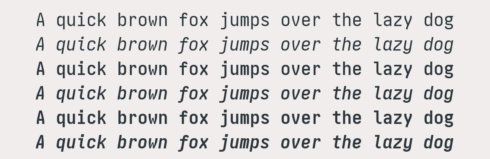
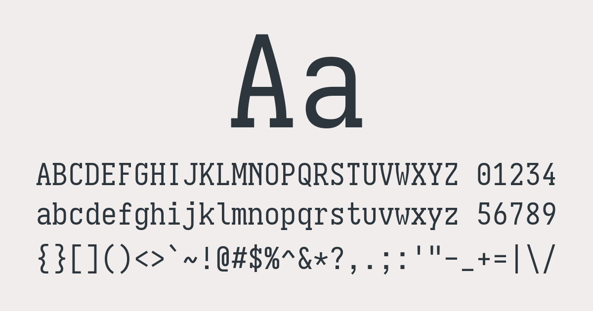
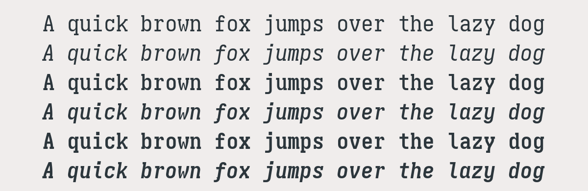
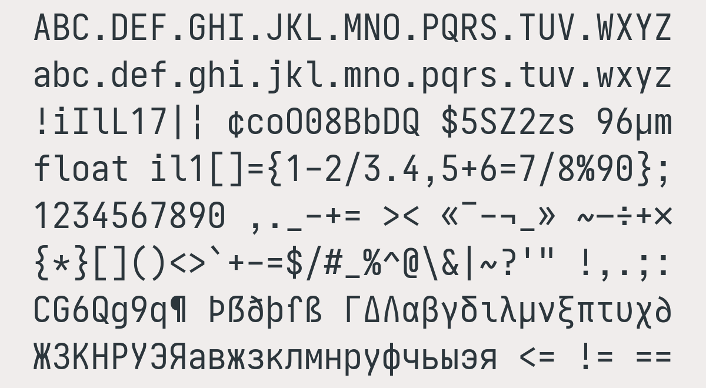
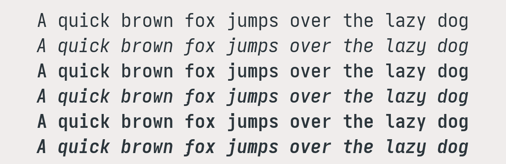
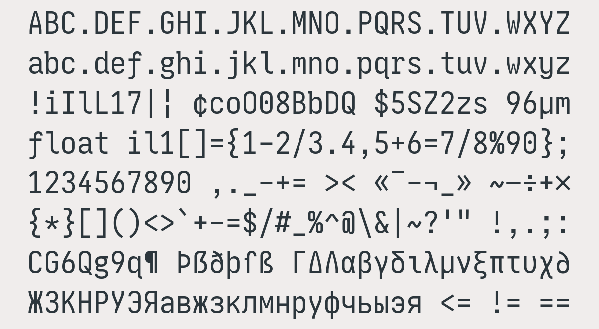
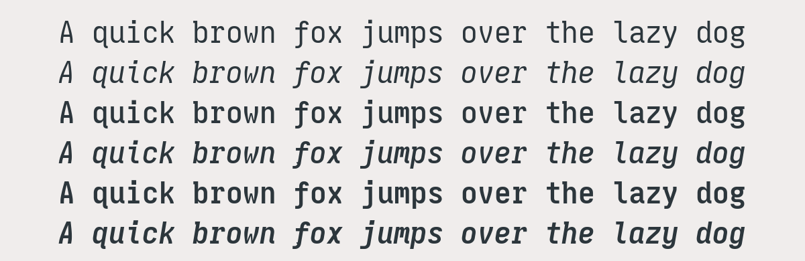
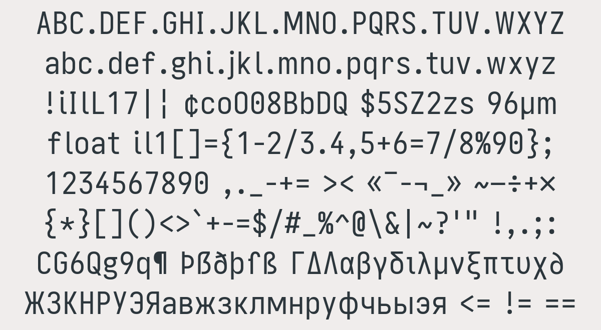
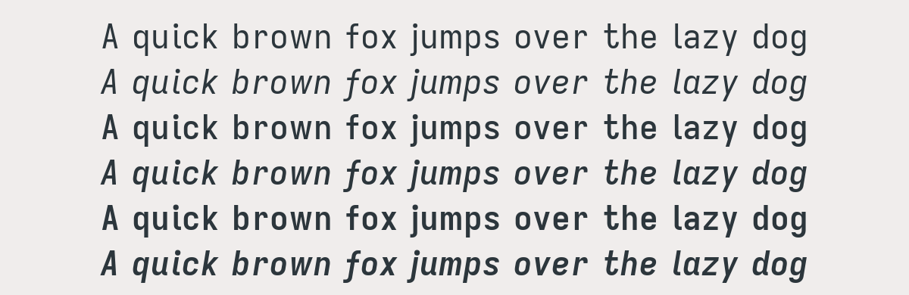

# Zenbones Mono

Comfy. Condensed. Coding.

A custom [Iosevka](https://github.com/be5invis/Iosevka) build drawing
inspirations from various programming typefaces.

- Semi-condensed
- Inherits Pragmata Pro variant
- Higher xHeight
- Slightly thicker regular width
- Cherry-picked letter variants inspired from various programming fonts and also
  some personal tastes

## Variants

| Variant                    | Inspiration                                                                                                                     |
| -------------------------- | ------------------------------------------------------------------------------------------------------------------------------- |
| [Zenbones Mono](#mono)     | [Pragmata Pro](https://fsd.it/shop/fonts/pragmatapro/)                                                                          |
| [Zenbones Slab](#slab)     | Slab version                                                                                                                    |
| [Zenbones Brainy](#brainy) | [JetBrains Mono](https://www.jetbrains.com/lp/mono/) and [Berkeley Mono](https://berkeleygraphics.com/typefaces/berkeley-mono/) |
| [Zenbones Proto](#proto)   | [0xProto](https://github.com/0xType/0xProto)                                                                                    |
| [Zenbones Prose](#prose)   | Quasi-proportional version                                                                                                      |

## Install

The font can be download from the
[release page](https://github.com/zenbones-theme/zenbones-mono/releases).

## Specimen

### Mono


#### Weights



### Slab



#### Weights



### Brainy



#### Weights



### Proto



#### Weights



### Prose



#### Weights



## Customization

This build has full access to
[Iosevka's customizations](https://github.com/be5invis/Iosevka/tree/main/doc).
And so you can simply use the character/stylistic variant sets available. For
example, you want to enable Texture Healing and the rounder parenthesis in
Kitty:

```
font_features Zenbones-Mono                 +TXTR +cv07=10 +cv10=13 +VSAG=1
font_features Zenbones-Mono-Semibold        +TXTR +cv07=10 +cv10=13 +VSAG=1
font_features Zenbones-Mono-Italic          +TXTR +cv07=10 +cv10=13 +VSAG=1
font_features Zenbones-Mono-Semibold-Italic +TXTR +cv07=10 +cv10=13 +VSAG=1
```

## Other inspirations

- [Pragmasevka](https://github.com/shytikov/pragmasevka)
- [Iosvmata](https://github.com/N-R-K/Iosvmata)
